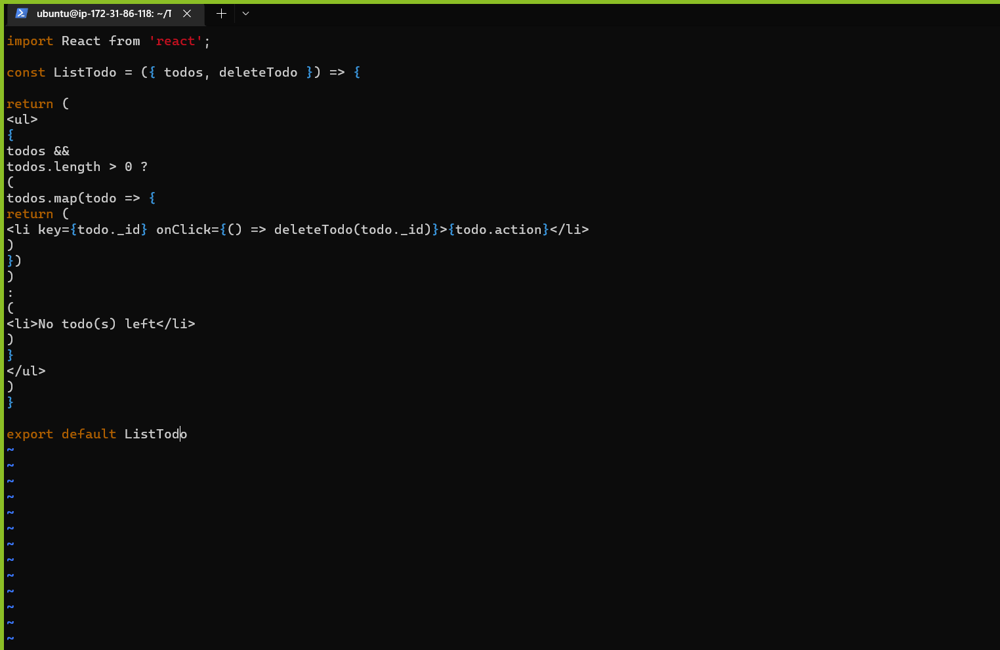

## MERN WEB STACK
> Create a AWS instance with an Ubuntu server
### BACKEND CONFIURATION
> Update ubuntu

    sudo apt update

> Upgrade ubuntu

     sudo apt upgrade


> Get the location of node.js software from ubuntu repositories

     curl -fsSL https://deb.nodesource.com/setup_18.x | sudo -E bash -


> Install Node.JS on the server

       sudo apt-get install -y nodejs
Note: The command above installs both node.js and npm. NPM is a package manager for Node like .apt for ubuntu, it is used to install Node modules and packages and to manage dependency conflicts.

> Verify the node installation 

     node -v
     npm -v 


##### **Application Code Setup**
> Create a new directory for to-do project

      mkdir Todo
> Verify the command ran by using the command

      ls


> Change directory to the newly created directory

       cd Todo

> Initialise project and create a new json file that contains information about the application

       npm init

> Run the ls command to confirm the pacakge was created

> Install ExpressJS using npm

        npm install express

> Create a file index.js 

      touch index.js


> Install the dotenv module

      npm install dotenv


> Open the file index.js with ; 

     vim index.js
> Paste the following 

      const express = require('express');
    require('dotenv').config();

    const app = express();

    const port = process.env.PORT || 5000;

    app.use((req, res, next) => {
    res.header("Access-Control-Allow-Origin", "\*");
    res.header("Access-Control-Allow-Headers", "Origin, X-Requested-With, Content-Type, Accept");
    next();
    });

    app.use((req, res, next) => {
    res.send('Welcome to Express');
    });

    app.listen(port, () => {
    console.log(`Server running on port ${port}`)
    });

Save the file and exit vim

> Type the following code in the index.js directory

     node index.js


> Edit inbound rules on EC2 instance; add port 5000


> Open browser and access server's public IP address or DNS name by port 5000

    http://44.201.214.36:5000 - Public IP address
               or
    http://ec2-44-201-214-36.compute-1.amazonaws.com:5000 - DNS address


> Create a folder that will define endpoints that the TO-do app will depend on.

        mkdir routes
> Change the directory to routes folder

      cd routes
> Create a file api.js 

      touch api.js

> Open the files with vim

     vim api.js
> Paste the following into the file

    const express = require ('express');
    const router = express.Router();

     router.get('/todos', (req, res, next) => {

    });

    router.post('/todos', (req, res, next) => {

    });

    router.delete('/todos/:id', (req, res, next) => {

    })

    module.exports = router;

> Save and exit vim

> Install MONGOOSE; it is a Node.js packae taht makkes working with mongdb easier
> Change diretory to todo folder before installing

    npm install mongoose

> Create a folder for models

      mkdir models
> Change directory into the newly created directory

       cd models

> Create a file inside the models folder

     touch todo.js

Note: Three commands can be defined in one line to be executed consequently with help of && operator

    mkdir models $$ cd models $$ touch todo.js

> Open vim todo.js and paste the following

    const mongoose = require('mongoose');
    const Schema = mongoose.Schema;

    //create schema for todo
    const TodoSchema = new Schema({
    action: {
    type: String,
    required: [true, 'The todo text field is required']
    }
    })

    //create model for todo
    const Todo = mongoose.model('todo', TodoSchema);

    module.exports = Todo;

> Update routes from the file api.js in routes directory to use new model
> Open api.js with vim api.js


> Delete the code with :%d the paste new code, save and exit


#### MONGODB DATABASE
> Sign into mLab; it provides database as a service solution(DBaaS) which would be used to store data


> Change IP Access list Entry to allow access from anywhere and change the time of deleting the entry from 6hours to 1 week


> Create a MongoDB database and collection inside mlab


> Create a file in Todo directory and name it .env

       touch .env
> Then vi into it

      vi .env


> Cinfigure the cluster settings


> Update the index.js to reflect the use of .env so that Node.js can connect to the database
> Vim into index.js and paste the following

     const express = require('express');
    const bodyParser = require('body-parser');
    const mongoose = require('mongoose');
    const routes = require('./routes/api');
    const path = require('path');
    require('dotenv').config();

    const app = express();

    const port = process.env.PORT || 5000;

    //connect to the database
    mongoose.connect(process.env.DB, { useNewUrlParser: true, useUnifiedTopology: true })
    .then(() => console.log(`Database connected successfully`))
    .catch(err => console.log(err));

    //since mongoose promise is depreciated, we overide it with node's promise
    mongoose.Promise = global.Promise;

    app.use((req, res, next) => {
    res.header("Access-Control-Allow-Origin", "\*");
    res.header("Access-Control-Allow-Headers", "Origin, X-Requested-With, Content-Type, Accept");
    next();
    });

    app.use(bodyParser.json());

    app.use('/api', routes);

    app.use((err, req, res, next) => {
    console.log(err);
    next();
    });

    app.listen(port, () => {
    console.log(`Server running on port ${port}`)
    });


>   Start server 

       node index.js


##### TESTING BACKEND CODE WITHOUT FRONTEND USING RESTFUL API
> Install Postman on device


> Test all API endpoint to ensure they are okay
> Open Postman create a POST request to the API....


    http://54.175.132.119:5000/api/todos


> Make sure header key (Content-type) is set as (application/json)


> Create a POST request


> Create a GET request to API


> Delete request


#### STEP 2 FRONTEND CREATION
> Create a user interface for a web client(browser)

      npx create-react-app client


##### **Running a React App**
> **Important dependencies that need to be installed**

> Install concurrently

    npm install concurrently --save-dev


> Install nodemon

       npm install nodemon --save-dev


> In Todo folder open package.json file; replace the code


    "scripts": {
    "start": "node index.js",
    "start-watch": "nodemon index.js",
    "dev": "concurrently \"npm run start-watch\" \"cd client && npm start\""
    },


##### **Configure Proxy in package.json**
> cd into directory client
> Open the package.json file


> Cd into Todo directory and type the following command

      npm run dev


> Enable port 3000 on EC2 on security group


> Run the following on web browser

     3.87.141.105:3000 - IP address


##### **Creating react components**
> Cd into Todo directory then client directory then src directory
> Inside src directory create another folder called components

      mkdir components
> Cd into components
> Create the following files

      touch Input.js ListTodo.js Todo.js
> Open input.js file

       vi input.js
> Copy and paste the following
```javascript 
import React, { Component } from 'react';
import axios from 'axios';

class Input extends Component {

state = {
action: ""
}

addTodo = () => {
const task = {action: this.state.action}

    if(task.action && task.action.length > 0){
      axios.post('/api/todos', task)
        .then(res => {
          if(res.data){
            this.props.getTodos();
            this.setState({action: ""})
          }
        })
        .catch(err => console.log(err))
    }else {
      console.log('input field required')
    }

    }

    handleChange = (e) => {
    this.setState({
    action: e.target.value
    })
    }

    render() {
    let { action } = this.state;
    return (
    <div>
    <input type="text" onChange={this.handleChange} value={action} />
    <button onClick={this.addTodo}>add todo</button>
    </div>
    )
    }
    }

    export default Input
```


> To use Axios, run the following;

      cd ../..
**Note: using the above means moving two directories up**
> Install Axios

    npm install axios


#### **FRONTEND CREATION**
> Go to components directory

     cd src/components
> Open ListTodo.js

      vi ListTodo.js
> In the ListTodo.js Paste the following code

```javascript
      import React from 'react';

const ListTodo = ({ todos, deleteTodo }) => {

return (
<ul>
{
todos &&
todos.length > 0 ?
(
todos.map(todo => {
return (
<li key={todo._id} onClick={() => deleteTodo(todo._id)}>{todo.action}</li>
)
})
)
:
(
<li>No todo(s) left</li>
)
}
</ul>
)
}

export default ListTodo
```


> In Todo.js paste the following

```javascript
 import React, {Component} from 'react';
import axios from 'axios';

import Input from './Input';
import ListTodo from './ListTodo';

class Todo extends Component {

state = {
todos: []
}

componentDidMount(){
this.getTodos();
}

getTodos = () => {
axios.get('/api/todos')
.then(res => {
if(res.data){
this.setState({
todos: res.data
})
}
})
.catch(err => console.log(err))
}

deleteTodo = (id) => {

    axios.delete(`/api/todos/${id}`)
      .then(res => {
        if(res.data){
          this.getTodos()
        }
      })
      .catch(err => console.log(err))

}

render() {
let { todos } = this.state;

    return(
      <div>
        <h1>My Todo(s)</h1>
        <Input getTodos={this.getTodos}/>
        <ListTodo todos={todos} deleteTodo={this.deleteTodo}/>
      </div>
    )

}
}

export default Todo;
```


> Adjust react code
> Move into the src file 

    cd ..
> Run the following

       vi App.js
> After pasting exit the file
> In the same src directory open App.css and paste the following
```css
.App {
text-align: center;
font-size: calc(10px + 2vmin);
width: 60%;
margin-left: auto;
margin-right: auto;
}

input {
height: 40px;
width: 50%;
border: none;
border-bottom: 2px #101113 solid;
background: none;
font-size: 1.5rem;
color: #787a80;
}

input:focus {
outline: none;
}

button {
width: 25%;
height: 45px;
border: none;
margin-left: 10px;
font-size: 25px;
background: #101113;
border-radius: 5px;
color: #787a80;
cursor: pointer;
}

button:focus {
outline: none;
}

ul {
list-style: none;
text-align: left;
padding: 15px;
background: #171a1f;
border-radius: 5px;
}

li {
padding: 15px;
font-size: 1.5rem;
margin-bottom: 15px;
background: #282c34;
border-radius: 5px;
overflow-wrap: break-word;
cursor: pointer;
}

@media only screen and (min-width: 300px) {
.App {
width: 80%;
}

input {
width: 100%
}

button {
width: 100%;
margin-top: 15px;
margin-left: 0;
}
}

@media only screen and (min-width: 640px) {
.App {
width: 60%;
}

input {
width: 50%;
}

button {
width: 30%;
margin-left: 10px;
margin-top: 0;
}
}
```
> In the src directory open index.css
```javascript
body {
margin: 0;
padding: 0;
font-family: -apple-system, BlinkMacSystemFont, "Segoe UI", "Roboto", "Oxygen",
"Ubuntu", "Cantarell", "Fira Sans", "Droid Sans", "Helvetica Neue",
sans-serif;
-webkit-font-smoothing: antialiased;
-moz-osx-font-smoothing: grayscale;
box-sizing: border-box;
background-color: #282c34;
color: #787a80;
}

code {
font-family: source-code-pro, Menlo, Monaco, Consolas, "Courier New",
monospace;
}
```
> Cd into Todo directory

     cd ../..
> Inside the Todo directory run the following

     npm run dev


